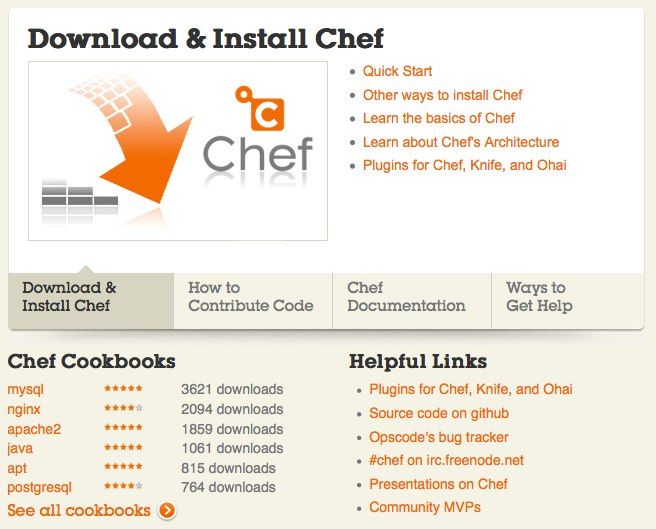
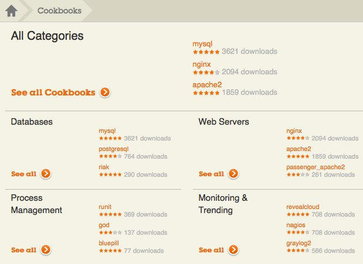
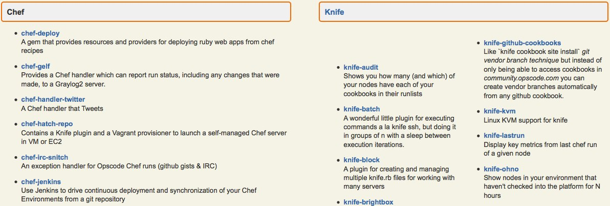

!SLIDE[tpl=default] bullets
# The Joy of Cooking #
## Deploying MongoDB with Chef ##
* Nathen Harvey, [CustomInk.com](http://www.customink.com)  

* [https://github.com/nathenharvey/deploying-mongo-with-chef](https://github.com/nathenharvey/deploying-mongo-with-chef)

* [@nathenharvey](http://twitter.com/nathenharvey)

!SLIDE
# Agenda #
* Infrastructure as Code
* Introduction to Chef
* Building a project in Chef
* Deploying MongoDB with Chef
* Additional resources

!SLIDE
# Evolution of Server Provisioning #

* Just build it
* Keep notes in server.txt
* Migrate notes to wiki 
* Custom shell scripts (in git)
* Systems integration framework

!SLIDE 
# Infrastructure as Code #

* Enable the reconstruction of the business   
from nothing but 
    * a source code repository
    * an application data backup
    * and bare metal resources

-Jesse Robins, Opscode

!SLIDE
# Chef #

* Declarative - What, not how
* Idempotent - Only take action if required
* Convergent - Takes care of itself

!SLIDE 
# Developer Happiness #

* MongoDB makes developers happy
* MongoDB makes operations happy
* Chef makes developers & operations happy, too!

!SLIDE
# Building a Chef Project #

* First, come up with your policy / specification
* Abstract the **resources** in your spec

!SLIDE
# Resources  

    @@@ruby
    package "mongodb-10gen" do
      version node['mongodb']['version']
      action :install
    end

    user node["mongodb"]["user"] do
      comment "MongoDB Server"
      gid node["mongodb"]["group"]
      supports :manage_home => true
      home "/home/#{node["mongodb"]["user"]}"
      action [ :create, :manage ]
    end

[More resources...](http://wiki.opscode.com/display/chef/Resources)

.notes http://wiki.opscode.com/display/chef/Resources

!SLIDE
# Building a Chef Project #

* First, come up with your policy / specification
* Abstract the **resources** in your spec
* Write **recipes**

!SLIDE
# Recipes

    @@@ruby
    include_recipe 'mongodb::users'

    service node['mongodb']['service_name'] do
      supports [:start, :stop, :restart]
    end

    template node['mongodb']['configfile'] do
      source "mongodb.conf.erb"
      cookbook "mongodb"
      variables(
        :dbpath => node['mongodb']['dbpath'],
        :logpath => node['mongodb']['logpath'],
        :port => node['mongodb']['port']
      )
    end
 

.notes http://wiki.opscode.com/display/chef/Recipes

!SLIDE
# Building a Chef Project #

* First, come up with your policy / specification
* Abstract the **resources** in your spec
* Write **recipes**
* Package recipes in **cookbooks**

.notes http://wiki.opscode.com/display/chef/Cookbooks
!SLIDE
# Cookbooks

    cookbooks/mongodb
    |-- README.md
    |-- attributes
    |   `-- default.rb
    |-- metadata.rb
    |-- recipes
    |   |-- 10gen_repo.rb
    |   |-- configure.rb
    |   |-- install.rb
    |   |-- mms.rb
    |   |-- replica_set.rb
    |   `-- users.rb
    `-- templates
        `-- default
            `-- mongodb.conf.erb

.notes http://wiki.opscode.com/display/chef/Cookbooks

!SLIDE
# Building a Chef Project #

* First, come up with your policy / specification
* Abstract the **resources** in your spec
* Write **recipes**
* Package recipes in **cookbooks**
* Apply recipes to **nodes**

.notes http://wiki.opscode.com/display/chef/Nodes

!SLIDE
# Nodes

* Representation of a host
  * runs the Chef client
  * has attributes
  * has a list of recipes to be applied

.notes http://wiki.opscode.com/display/chef/Nodes

!SLIDE
# Building a Chef Project #

* First, come up with your policy / specification
* Abstract the **resources** in your spec
* Write **recipes**
* Package recipes in **cookbooks**
* Apply recipes to **nodes**
* Group things into **roles**

.notes http://wiki.opscode.com/display/chef/Roles

!SLIDE
# Roles

* mechanism for easily composing sets of functionality
* have attributes and a list of recipes to be applied

.notes http://wiki.opscode.com/display/chef/Roles

!SLIDE
# Roles

    @@@ruby
    name "mongodc"
    description "Sample MongoDB Replica Set for MongoDC"
    default_attributes(
      "mongodb" => {
        "replicaset" => "mongodc"
      }
    )

    run_list(
      "recipe[mongodb::install]",
      "recipe[mongodb::configure]",
      "recipe[mongodb::replica_set]"
    )

.notes http://wiki.opscode.com/display/chef/Roles

!SLIDE
# Building a Chef Project #

* First, come up with your policy / specification
* Abstract the **resources** in your spec
* Write **recipes**
* Package recipes in **cookbooks**
* Apply recipes to **nodes**
* Group things into **roles**

!SLIDE slides incremental
# What is Chef? #

* Server - API, search, Web UI
* Client - chef-client
* Command line tool - knife

.notes http://wiki.opscode.com/display/chef/Architecture

!SLIDE commandline incremental
# knife

    $ knife help list
    bootstrap
    client
    configure
    cookbook
    cookbook-site
    data-bag
    environment
    exec
    index
    knife
    node
    role
    search
    shef
    ssh
    status
    tag

.notes http://wiki.opscode.com/display/chef/Knife

!SLIDE
# What is Chef? #

* Server - API, search, Web UI
* Client - chef-client
* Command line tool - knife
* Inspection library - ohai

!SLIDE
# ohai #

Collects detailed, extensible information about a host.

    @@@ javascript
    {
      "uptime": "13 days 06 hours 16 minutes 02 seconds",
      "platform": "ubuntu",
      "os_version": "2.6.32-38-generic",
      "cpu": {
        "total": 3,
        "real": 0,
        "2": {
          "cache_size": "4096 KB",
          "model": "2",
          "family": "6",
          ...
 
.notes http://wiki.opscode.com/display/chef/Ohai

!SLIDE
# What is Chef? #

* Server - API, search, Web UI
* Client - chef-client
* Command line tool - knife
* Inspection library - ohai
* REPL - shef

.notes http://wiki.opscode.com/display/chef/Shef, http://wiki.opscode.com/display/chef/Getting+Started+with+Shef

!SLIDE
# What is Chef? #

* Server - API, search, Web UI
* Client - chef-client
* Command line tool - knife
* Inspection library - ohai
* REPL - shef
* Community 

.notes http://community.opscode.com, http://wiki.opscode.com

!SLIDE
# community.opscode.com

!SLIDE
# Community Site

* Publish and share cookbooks

.notes http://community.opscode.com/cookbooks

!SLIDE
# Community Site

* Publish and share plugins for Chef, Knife, and Ohai

.notes http://wiki.opscode.com/display/chef/Community+Plugins
